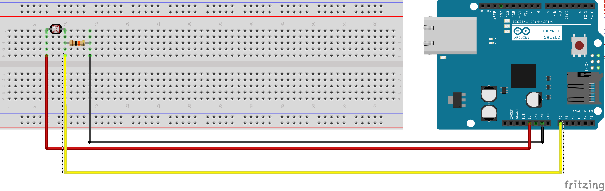

# Challenge 1

## Description
Στο πρώτο μέρος του Workshop υλοποιείται το:
Challenge 1/Photo_Resistor/Photo_Resistor.ino

## Installation 
- Κατέβασε τον κώδικα.
- Άνοιξε το  Arduino IDE και ανοίχτε τον κώδικα.
- Άνοιξε το serial port monitor.

## Usage
- Μπορείς αν θες να κατεβάσεις το Fritzing απο εδω: http://fritzing.org/download/ έτσι ώστε να μπορείς να αλλάξεις τον κώδικα.
