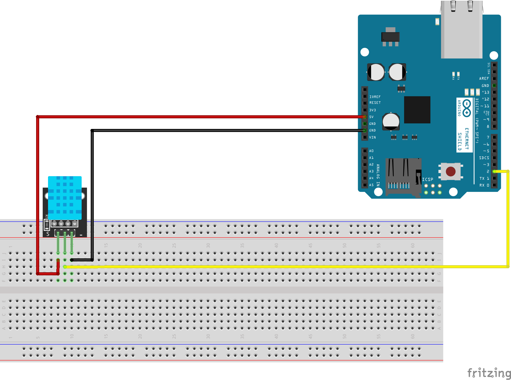

# Challenge 2

## Description
Σε δεύτερη φάση υλοποιείται το:
https://github.com/winlinvip/SimpleDHT 
Challenge 2/DHT11/DHT11.ino

## Installation 
- Κατέβασε τον κώδικα.
- Κατέβασε τις βιβλιοθήκες και εγκατέστησέ τις Σχέδιο -> Συμπερίληψη βιβλιοθήκης -> Προσθήκη βιβλιοθήκης ZIP ...
- Άνοιξε το  Arduino IDE και ανοίχτε τον κώδικα.
- Άνοιξε το serial port monitor.

## Usage
- Τις βιβλιοθήκες θα τις βρείς στο Libraries
- Μπορείς αν θες να κατεβάσεις το Fritzing απο εδω: http://fritzing.org/download/ έτσι ώστε να μπορείς να αλλάξεις τον κώδικα.
